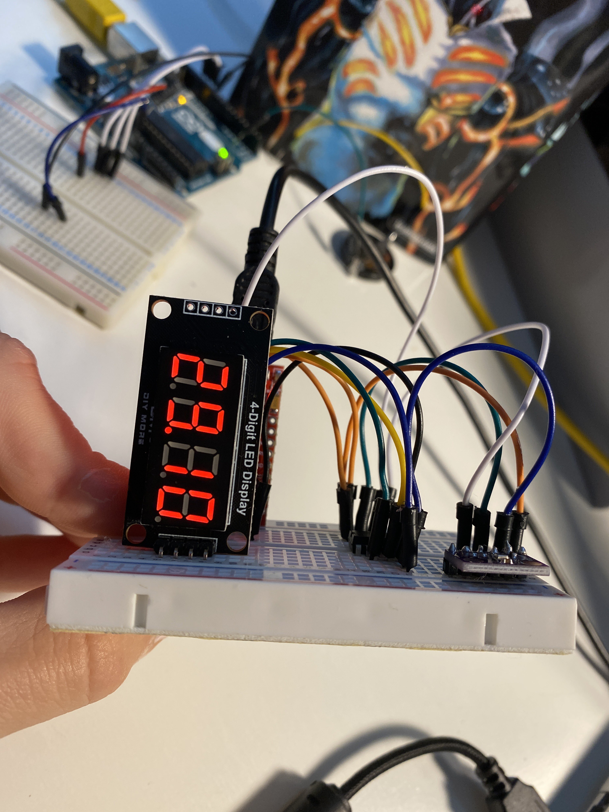

# ATTiny85 Temperature sensor display

A quick implementation for an ATTiny 85 a BMP280 sensor and a ssd1306 oled screen




## Hardware

- ATTiny85
- BMP280
- SSD1306 / TM1637
- FTDI programmer
- Arduino Uno (Optionnal used to flash the ATTiny85)

## Libraries

```cpp
#include <Arduino.h>
#include <TinyBMP280.h>
#include <SoftwareSerial.h>
#include <TinyWireM.h>
#include <Tiny4kOLED.h>
#include "TM1637Display.h" // If using the TM display

```

## Wiring


